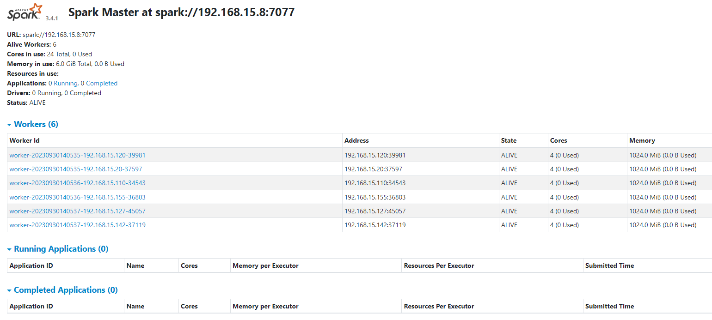
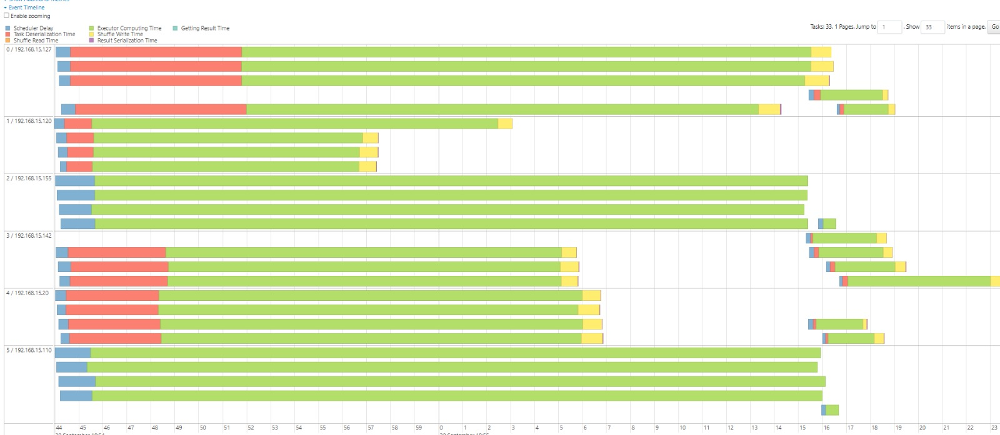
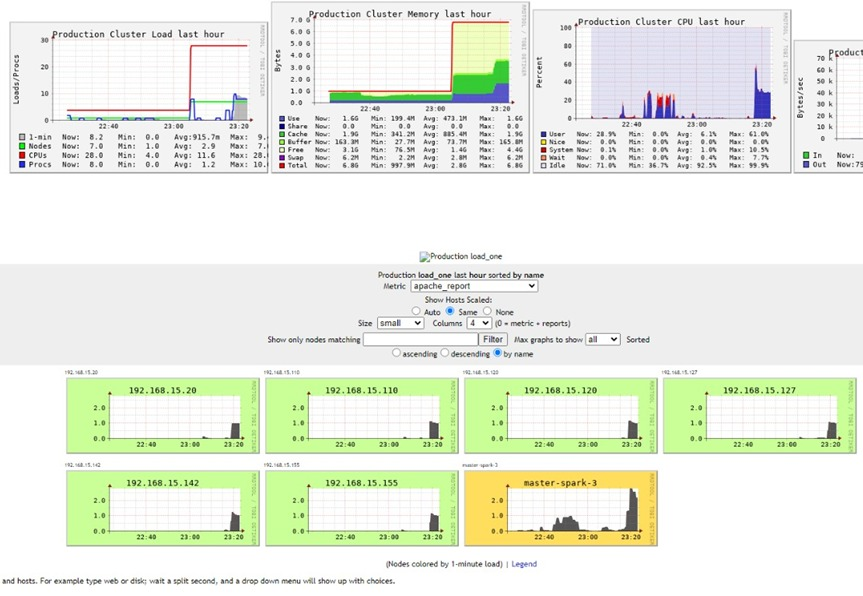

# Spark Lite Cluster

Este projeto oferece uma implementação Lite de um Cluster [Apache Spark](https://spark.apache.org/docs/3.4.1) e conta com um [CIFS File System](https://docs.kernel.org/admin-guide/cifs/index.html) para compartilhamento de arquivos em rede assim como [Ganglia](https://github.com/ganglia) para observabilidade. 
Essa implementação foi aprensetada e publicada com sucesso no Seminário de Iniciação Científica do Litoral Norte (**ISSN 2674-6689**)

[Processamento Distribuído na Borda: Um Estudo de Desafios e Oportunidades Utilizando Aparelhos de Tv Box Apreendidos pela Receita Federal](https://ocs.ifspcaraguatatuba.edu.br/sicln/xiii-sicln/paper/view/463)


## Instalação

Recomendamos o uso das **imagens prontas** pois o seu uso requer menos gerencialmento de dependências e Know-how sobre os assuntos tratados pelos scripts de instalação manual

[Guia de Instalação](scripts/setup/README.md)

## Uso
Faça SSH via ip da máquina mestre `ssh root@<IP-MASTER>`
Use a senha padrão *0880* para instalação feita via Imagem ou sua senha definida na instalação Manual.

Execute o script para reiniciar o servidor de métricas:
```shell
./restart-ganglia.sh
```

Após a execução desse comandos o servidor ganglia estará disponível no URL: 
- <http://IP-MASTER/ganglia/>

Execute o script para relizar o *mount* do diretório de rede compartilhado
```shell
./mount-cifs.sh
```

Execute para habilitar os comandos de ambiente: 
```shell
source .bashrc
```

E Finalmente execute o comando abaixo para inicializar o cluster:
```shell
start_cluster
``` 
Esse comando irá inicializar o Cluster Spark e seu servidor de métricas.

Após a execução desses comandos o cluster estará operacional no URL: 

 - <http://IP-MASTER:8080/>

E o servidor de métricas no URL: 

 - <http://IP-MASTER:18080/>


### Executando Aplicações no Cluster:

 Para executar aplicações basta executar o comando [spark-submit](https://spark.apache.org/docs/3.4.1//submitting-applications.html) para sua aplicação spark (*`.jar`* ou *`.py`*)

```shell

spark-submit --master spark://<IP/DO/MASTER> \
  --executor-cores 4 \
  --executor-memory 400M \
  --conf spark.default.parallelism=24 \
  --conf spark.executor.memoryOverhead=100M \
   Caminho/para/aplicacao/main.py 
```

## Interface Gráfica e Observabilidade

Interface gráfica da Máquina Mestre (Orquestradora) do Apache Spark

 - <http://IP-MASTER:8080/>
 

Servidor de Metricas de Trabalho do Apache Spark

 - <http://IP-MASTER:18080/>
 

 Servidor de Metricas de Cluster do agente de Observabilidade Ganglia

 - <http://IP-MASTER:18080/>
 


## Utilitários

Estão presentes sobre o diretório `/root` e foram pensados para facilitar algumas ações dentro do cluster. 

### Reinício do Ganglia
- Necessário executar `restart-ganglia.sh` para reiniciar o monitor Ganglia em todos os nós.
- Reinicia o Servidor acessível na URL <http://IP-do-mestre/ganglia/>

### Mount Point compartilhado
- Necessário executar `mount-cifs.sh` para reiniciar o CIFS (*File System*) para acesso ao diretório compartilhado de rede sobre o mount point `/mnt/cifs_shared/`

### Desliga Cluster
- Necessário executar `shutdown-cluster.sh` para desligar todas as máquinas do cluster a partir da máquina mestre